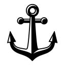

# url-tracker

 
 
    

 

[Check this extension](https://chrome.google.com/webstore/detail/url-tracker/aeledpmgdlojbmdllfejoefinemkhbbo)

**Categorize whether the current web-page is useful or not!**

When you search any thing in google chrome, you get some results as links, which is similar or same what you looking for. Generally you go through all those links (in top-down order) until you get desired result.
Sometimes you search the same thing , which you searched some time ago(i.e mins, hours, days, weeks, etc)
But this time you don't remember which one of results will solve your problem.
Won't it be good, if you know which result solved your problem last time , and this time you also know where to click for that specific result? 
This  saves a lot of your time , you don't have to go through all those pages. With this extra time you can do something which need your attention/presence most.

So this *extension* help you **categorize web page as** *Useful* **or** *Not useful*. Next time when you search same result, *Useful link* will be `Green`, while *Not useful link* will be `Red`.
***
**How to use?**
* [Install it](https://chrome.google.com/webstore/detail/url-tracker/aeledpmgdlojbmdllfejoefinemkhbbo)
* Pin this extension on *extensions tab*
* If you find a web page useful, click this extension icon & then `Yes`
* If you don't find a web page useful, click the extension icon & then `No`
* Press `Alt+1` for *Useful webpage*
*  Press `Alt+0` for *Not useful webpage*

***

**Why not bookmark web page?**

Bookmarking is great way for saving useful web page in browser. But over the time your bookmark list can become very long & it is annoying to go though all bookmark title before search in chrome . 
Instead just search your query in chrome, if the webpage was saved by you using this extension in past, the webpage link will be `highlighted` with `green` or `red` color.

 

***

*Only for chrome browser*
